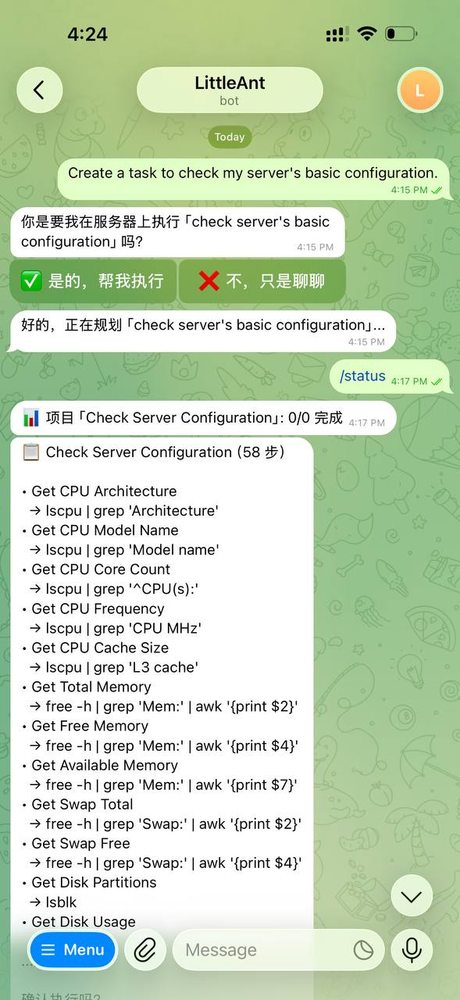
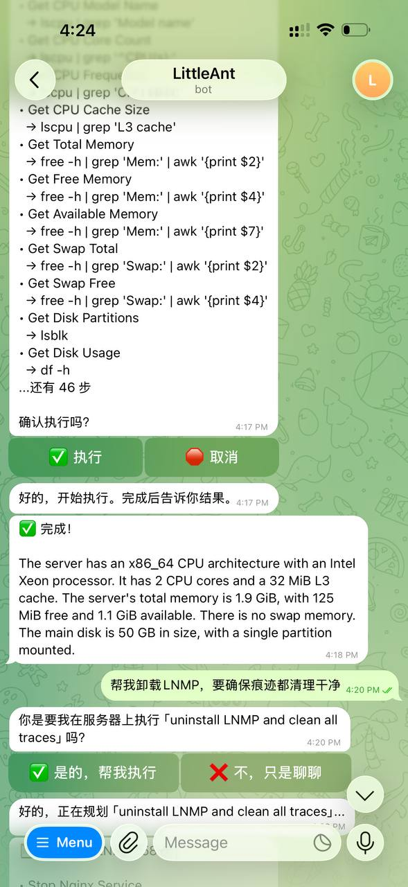
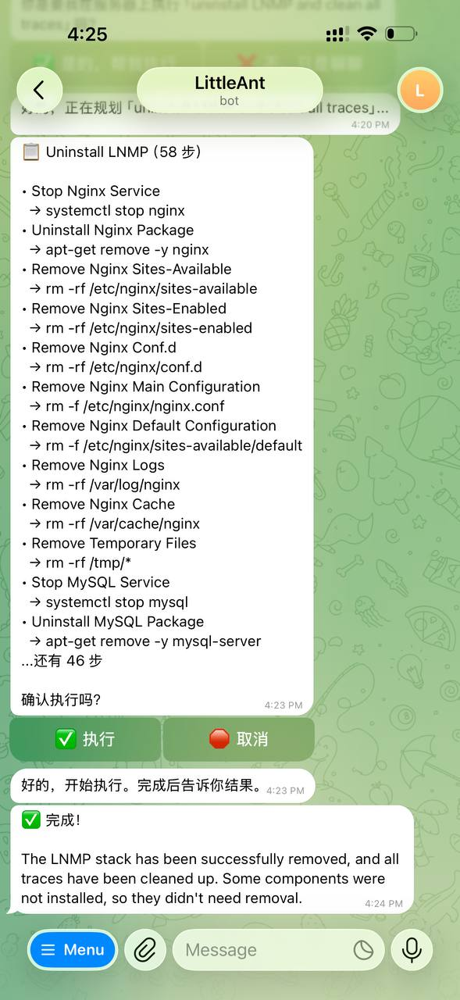

<p align="center">
  <h1 align="center">🐜 LittleAnt V12.1</h1>
  <p align="center"><strong>AI Intent Execution System</strong></p>
  <p align="center">
    Compile natural language intent into executable, verifiable, recoverable server actions — via recursive decomposition.
  </p>
  <p align="center">
    <a href="https://github.com/shellylittleant/littleant/blob/main/LICENSE"></a>
    <a href="https://www.python.org/"></a>
    <a href="https://github.com/shellylittleant/littleant/releases"></a>
    <a href="https://github.com/shellylittleant/littleant/stargazers"></a>
  </p>
</p>

---

LittleAnt is an AI butler that lives on your server. You talk to it through Telegram, and it autonomously executes tasks — installing software, configuring services, writing scripts, monitoring systems, and more. Zero third-party Python dependencies.

<!-- 
TODO: Replace with your Telegram screenshot



-->

## Why LittleAnt?

Most AI agent frameworks are **chat-first**: they generate text and hope it's useful. LittleAnt is **execution-first**: every output is a real command that runs on your server, gets mechanically verified, and recovers autonomously on failure.

| | Chat-first Agents | LittleAnt |
|---|---|---|
| **Output** | Text / suggestions | Executable shell commands |
| **Verification** | None or AI-based | Mechanical (zero AI tokens) |
| **Failure handling** | Crash or ask user | AI self-recovers (retry / modify / skip) |
| **Task decomposition** | One-shot plan | Recursive, layer by layer |
| **Transparency** | Black box | Full execution tree, every step logged |
| **Dependencies** | pip install dozens of packages | Zero. Pure Python stdlib |

## Architecture

```
┌─────────────┐     Natural Language     ┌──────────────────┐
│    User      │◄──────────────────────►│  Front-end AI     │
│  (Telegram)  │                         │  (Chat, ReadOnly) │
└─────────────┘                         └────────┬─────────┘
                                                 │ DB queries
                                                 │ Read-only commands
                                                 │ Initiate tasks
                                        ┌────────▼─────────┐
                                        │   LittleAnt Core  │
                                        │   (Orchestrator)  │
                                        └────────┬─────────┘
                                                 │ JSON Protocol
                                        ┌────────▼─────────┐
                                        │  Back-end AI      │
                                        │  (Execute, R/W)   │
                                        └──────────────────┘
```

**Front-end AI** — Chats with users, has memory (20-turn context), runs read-only commands (`free -h`, `crontab -l`, `systemctl status`), reports results in plain language. Cannot modify anything.

**Back-end AI** — Communicates only via JSON. Decomposes tasks recursively, generates executable commands, handles failures autonomously. Full read-write access.

**Core** — Executes commands, mechanically verifies results, persists state, manages lifecycle. All verification is code-based (zero AI tokens).

## Supported AI Providers

| Provider | Model | Status |
|----------|-------|--------|
| OpenAI | GPT-4o | ✅ Tested |
| Anthropic | Claude Sonnet | ✅ Supported |
| Google | Gemini 2.0 Flash | ✅ Supported |
| xAI | Grok 3 | ✅ Supported |

Any OpenAI-compatible API endpoint works. Choose during setup.

## Quick Start

### Requirements
- Python 3.10+ (no pip install needed — zero dependencies)
- A Telegram Bot Token (from [@BotFather](https://t.me/BotFather))
- An API key from any supported provider

### Install

```bash
git clone https://github.com/shellylittleant/littleant.git
cd littleant
python3 setup.py
```

The setup wizard asks:
1. 🌐 Language (English / 中文)
2. 🤖 Telegram Bot Token
3. 🧠 AI Provider (OpenAI / Claude / Gemini / Grok)
4. 🔑 API Key

### Run

```bash
bash start.sh
```

### Run as a Service (recommended)

```bash
# Edit WorkingDirectory in littleant.service to your install path
cp littleant.service /etc/systemd/system/
systemctl daemon-reload
systemctl enable littleant
systemctl start littleant
```

## Usage

Open Telegram, find your bot, and chat:

| What you say | What happens |
|---|---|
| "How do I configure nginx?" | AI answers directly (chat mode) |
| "Help me install LNMP" | Confirms → plans → you approve → executes → reports results |
| "What's in crontab?" | Runs `crontab -l` directly (read-only) and tells you |
| "What's my disk usage?" | Runs `df -h`, summarizes in plain language |
| /status | Shows current task progress |
| /cancel | Cancels current task |

### How a Task Executes

```
1. You: "Help me install WordPress"
2. Front-end AI: "Do you want me to execute this?" → You confirm
3. Back-end AI generates execution plan → You review and approve
4. Program executes each step silently, verifies each result mechanically
5. If something fails → AI retries / modifies / skips autonomously
6. When done → Front-end AI summarizes results in plain language
```

## Real-World Use Cases

LittleAnt has been used on production servers for:

- **LNMP Stack** — Nginx + MySQL + PHP installed, configured, and verified in one conversation
- **Server Monitoring** — Custom monitoring plugin written and deployed
- **Scheduled Tasks** — Cron jobs configured with Telegram notifications
- **SSL & CDN** — Cloudflare integration plugin developed
- **Web Crawlers** — Spider tools built and executed
- **System Diagnostics** — Full server audit with plain-language report

## Project Structure

```
littleant/
├── setup.py                 # Setup wizard
├── run.py                   # Main entry point
├── start.sh                 # One-command startup
├── littleant.service         # systemd service file
├── docs/
│   └── WHITEPAPER.md        # Full technical whitepaper
├── littleant/
│   ├── i18n/                # Language files (en.json, zh.json)
│   ├── ai/adapter.py        # Multi-provider AI adapter
│   ├── core/
│   │   ├── decomposer.py    # Recursive decomposition engine
│   │   ├── executor.py      # Command executor
│   │   ├── verifier.py      # 8 mechanical verifiers
│   │   ├── recovery.py      # Autonomous error recovery
│   │   ├── orchestrator.py  # Main orchestrator + tool library
│   │   ├── protocol.py      # Command protocol (20 cmds + 7 feedbacks)
│   │   └── readonly_executor.py  # Read-only executor with whitelist
│   ├── models/project.py    # Data models & state machine
│   └── storage/             # JSON + SQLite persistence
└── README.md
```

## Design Principles

> **"AI is the operator. Program is the computer."**

- Command set is finite — AI chooses from predefined commands, can't invent new ones
- All verification is mechanical — zero AI token consumption
- Failed nodes are **deleted** from the chain, not marked — execution continues automatically
- Successful projects auto-save to template library — AI reuses them next time
- The operator can be swapped (GPT → Claude → Gemini) — the protocol stays the same

## Documentation

- 📄 [Whitepaper (English)](docs/WHITEPAPER.md) — Full architecture, protocol, and design specification

## Contributing

Contributions welcome! See [CONTRIBUTING.md](CONTRIBUTING.md) for guidelines.

## License

[MIT](LICENSE)

---

<p align="center">
  <sub>Built with recursive decomposition and mechanical verification.<br>Zero dependencies. Zero trust in AI output.</sub>
</p>
